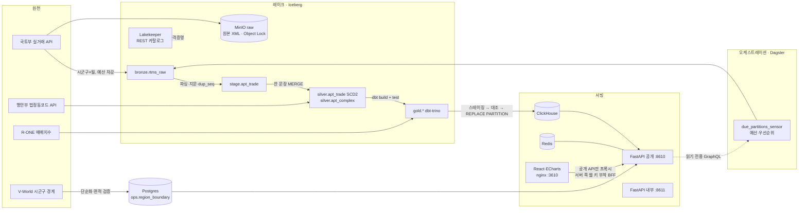

# AptLake — 집값 레이크하우스

전국 아파트 매매 실거래 신고 자료를 **Iceberg 레이크하우스(Bronze → Silver → Gold)** 로 쌓고,
고유 ID가 없고 나중에 값이 바뀌는 원천을 **지문 키 + 한 문장 MERGE(SCD2)** 로 정합하게 관리하며,
**품질 검사를 통과한 데이터만** ClickHouse 서빙 계층과 **API 키·쿼터·계측이 있는 데이터 API** 로 제공합니다.

> 공개 신고 자료를 가공한 학습·포트폴리오용 서비스입니다. 자체 산출 지수는 공식 통계가 아니며 투자 판단 근거로 쓰지 마세요.
> (모든 API 응답과 화면에 같은 문구를 표시합니다.)

| 화면 | 주소 (모두 127.0.0.1 바인딩) |
|---|---|
| 웹 (시장 개요·지역 분석·거래·지수·품질·개발자·수집 상태) | http://127.0.0.1:3610 |
| 공개 데이터 API · OpenAPI 문서 | http://127.0.0.1:8610/docs |
| 관리 API (내부 리스너) | http://127.0.0.1:8611/docs |
| Dagster (자산·파티션·검사) | http://127.0.0.1:3600 |
| Grafana (`make obs`) | http://127.0.0.1:3620 |

---

## 1. 풀려는 문제

1. **고유 ID 가 없다.** 응답에 거래 식별자가 없고, 같은 단지·면적·층·날짜·금액 거래가 여러 건일 수 있다 (실측: 2024-07 종로·분당 776건 중 33개 그룹).
2. **값이 나중에 바뀐다.** 해제여부·해제일·등기일·동명이 사후에 채워진다 → 한 번 받고 끝내면 해제 거래가 통계에 남는다.
3. **호출 예산이 있다.** 개발계정 일 10,000회, 시군구 256 × 계약월 수백 개를 나눠 수집해야 한다.

→ "재수집해도 중복되지 않고, 바뀐 값은 이력으로 남고, 검사를 통과한 데이터만 공개되는" 파이프라인이 본체.

## 2. 아키텍처



- **엔진은 스토리지 키를 갖지 않습니다.** Trino·PyIceberg 는 Lakekeeper 가 STS 로 발급한 테이블 경로 범위 단기 자격증명(vended credentials)으로만 MinIO 에 접근합니다. 장기 키는 카탈로그 계정 하나.
- **발행은 원자적입니다.** gold 월 파티션 → ClickHouse `*_staging` 적재 → Trino 결과와 건수·합계 대조 → `REPLACE PARTITION`. 대조가 틀리면 서빙 테이블은 이전 데이터 그대로입니다.
- **데이터셋 버전.** 발행마다 `gold@YYYY-MM-DD.n` 과 입력 Iceberg 스냅샷 ID(bronze·silver·gold)를 기록 → API 응답 헤더 `X-Dataset-Version` / `X-Data-As-Of`, 캐시 키·ETag 에 포함, `/v1/quality/partitions/{sgg}/{ym}` 에서 계보로 조회.
- **웹은 BFF.** 브라우저에는 API 키가 없습니다. nginx 가 서버 쪽 웹 전용 키(`WEB_API_KEY`)를 붙여 공개 API 로만 넘기고, 이 키의 한도(`web` 플랜, 분당 300)는 키 전체가 아니라 **브라우저 IP 마다**(HMAC) 셉니다. 사용자가 직접 넣은 `X-API-Key` 는 그대로 통과합니다.
- **전국·시도 집계도 gold 에서.** `region_rollup_month`(dbt)가 시도·전국 월 집계를 정확 분위수로 만들고, 전국 건수 = 시군구 합 대조 테스트를 통과해야 발행됩니다 (화면에서 시군구 256개를 다시 더하지 않음).

## 3. 기획서 대비 구현 결정

기획서의 기술 스택을 그대로 따르지 않고, 로컬(M1 16GB, Docker VM 7.7GB 중 다른 프로젝트가 약 3.8GB 사용)에 맞게 조정했습니다. 자세한 근거는 [docs/decisions.md](docs/decisions.md).

| 기획 | 구현 | 이유 |
|---|---|---|
| Spark 3.5 MERGE INTO | **Trino MERGE** (Iceberg) | Spark JVM 3GB 를 뺄 수 있음. Trino MERGE 가 조건부 WHEN 절을 지원해 SCD2 를 한 문장으로 표현 |
| SCD2 한 번 vs 두 단계 (U-4) | **한 문장** (UPSERT·NEWVER·MISSING 세 갈래 원천) | 한 스냅샷 = 원자적. '닫기'와 '새 버전' 사이 중간 상태가 없음 |
| REST 카탈로그 Lakekeeper vs Polaris (U-1) | **Lakekeeper v0.13.6** + vended credentials | 엔진이 장기 키를 갖지 않음 |
| Dagster 파티션 = 시군구 × 월 | **파티션 = 계약월**, 시군구 상태는 `ops.ingest_partition` | 256×수백 = 수만 개 Dagster 파티션은 실행 오버헤드가 수집 비용보다 큼 |
| MinIO | **Silo**(MinIO 유지보수 포크, Lakekeeper 공식 예제 사용) | 커뮤니티 이미지 배포 중단 |
| API 하나 + 127.0.0.1 검사 | **공개·내부 리스너 분리** | 관리 라우트가 공개 프로세스에 아예 없음 (도커 포워딩에서는 원 IP 를 믿을 수 없음) |
| ClickHouse `ReplacingMergeTree` + FINAL | **MergeTree + 파티션 교체** | 발행 시점에 중복이 없으므로 FINAL 비용 불필요 |

## 4. 정합성 설계

**지문 키 · 순번** ([fingerprint.py](pipeline/src/aptlake_pipeline/rtms/fingerprint.py))
- `trade_key = sha256(시군구 | 법정동 | 정규화 지번 | 정규화 단지명 | 면적(4자리) | 계약일 | 금액 | 층)` — 사후에 바뀌는 필드는 제외하고 `attr_hash` 로 따로 비교.
- `dup_seq` 는 입력 순서가 아니라 `(trade_key, attr_hash)` 정렬로 부여 → **API 가 같은 결과를 다른 순서로 줘도 같은 순번** (hypothesis 속성 테스트).
- 공개 ID `trade_id = {시군구}-{계약월}-{지문 16자}-{순번}` → 서빙 계층에서 파티션 가지치기.

**한 문장 SCD2 MERGE** ([silver.py](pipeline/src/aptlake_pipeline/silver.py)) — Trino MERGE 는 대상 1행에 원천 1행만 매칭되고 `NOT MATCHED BY SOURCE` 가 없어서 원천을 세 갈래로 만든다.

| 원천 행 | 매칭 | 동작 |
|---|---|---|
| UPSERT (이번 수집 전부) | 현재행과 속성 같음 | `last_seen` 갱신 |
| | 속성 다름 | 현재행 닫기 (`is_current=false, valid_to`) |
| | 없음 | 신규 거래 INSERT |
| NEWVER (속성 바뀐 행, 매칭 키 NULL) | 항상 불일치 | 새 버전 INSERT (`version+1`) |
| MISSING (이번 수집에 없는 현재행) | 현재행 | 삭제하지 않고 `missing_since` |

**품질 게이트** — 실패하면 하위로 전파되지 않습니다.

| 층 | 검사 | 차단 |
|---|---|---|
| bronze (시군구 단위) | 원천 스키마 v1 일치, 전 행 파싱·파티션 소속, 이전 대비 30% 넘는 급감 | 그 시군구만 QUARANTINED, 나머지 진행 (FR-104) |
| bronze (월) | LOADED 행 스키마 재검증, 격리율 < 20% | Dagster blocking asset check |
| silver | 현재행 키 중복 0, 시군구별 stage 행 수 = 관측 현재행 수 | blocking |
| silver | 3회 연속 미관측, 해제 비율 10%p 급변, 동일 지문 그룹 수 | 경고 |
| gold (dbt) | unique·not_null·relationships·accepted_values·범위·`trades+cancelled=reported`·분위수 순서 | 실패 시 dbt build 실패 → 같은 실행의 ClickHouse 발행 안 됨 |
| 발행 | Trino ↔ ClickHouse 건수·합계 대조 | 불일치 시 파티션 교체 안 함 |
| 복구 | silver 반영 후 발행 전 실패한 달은 `needs_publish` 로 남고, 센서가 원천 호출 0회로 검사 재계산 → gold → 발행 | 발행 누락 방지 |

**정확 분위수.** `approx_percentile` 대신 선형 보간 정확 분위수 SQL 매크로 → 실측 **numpy.percentile 과 차이 0.0** (종로 55건, 분당 691건).

## 5. 보안 설계 (구현된 것)

| 위협 | 대응 | 위치 |
|---|---|---|
| DB 유출 시 키 재사용 | 키 `al_live_<id>.<secret>`, 서버는 `HMAC-SHA256(pepper, secret)` 만 저장, 상수시간 비교, 없는 키도 같은 비용으로 비교 | [keys.py](api/src/aptlake_api/keys.py), [auth.py](api/src/aptlake_api/auth.py) |
| 폐기 지연 | 폐기 시 Redis 키 캐시 즉시 삭제 + 프로세스 캐시 TTL 5초 | `DELETE /v1/admin/keys/{id}` |
| 스코프 누락 | 모든 라우트가 `require_scope` 를 선언했는지 **기동 시 검사**, 빠지면 기동 실패 (include_router 안쪽까지) | [deps.py](api/src/aptlake_api/deps.py) |
| 관리 API 원격 호출 | 관리 라우트는 별도 프로세스·포트(:8611), 웹 프록시는 공개 API 만 전달(`/v1/admin` 은 404), 모든 변경은 append-only 감사 로그 | compose `api-internal`, [aptlake.conf.template](web/templates/aptlake.conf.template) |
| 브라우저에 키 노출 | 웹은 BFF: nginx 가 서버 쪽 웹 키를 붙이고 브라우저에는 키가 없음. 웹 키 한도는 브라우저 IP(HMAC) 단위, 키 순환 시 이전 키 자동 폐기 | [provision.py](api/src/aptlake_api/provision.py), [auth.py](api/src/aptlake_api/auth.py) |
| 운영 화면으로 비밀 유출 | 오류 로그·센서 메시지의 비밀값 가림(인증키 파라미터·DSN 비밀번호·인증 헤더·S3 자격증명·서명), 실행 설정(run config)은 내보내지 않음, Dagster 는 고정 읽기 질의만 | [ops.py](api/src/aptlake_api/ops.py) |
| SQL 주입 | ClickHouse 서버측 파라미터 바인딩만, 식별자 허용 목록, 경로·쿼리 정규식 검증. dbt var·Trino 리터럴은 형식 검증 후에만 | [routes_public.py](api/src/aptlake_api/routes_public.py), [silver.py](pipeline/src/aptlake_pipeline/silver.py) |
| 대량 추출 | 분당 요청(슬라이딩 윈도우, Redis Lua 원자) + 일일 행 한도 + 기간 상한 + **서명된 커서**(다른 질의 재사용·변조 시 400) + 대량은 비동기 내보내기(pro). 행 한도는 거래 단위 레코드(거래 목록·이력·산점도 점·단지 이력)에만 매기고, 원자료를 내보내지 않는 집계(월 통계·지도·순위·지수)는 요청 수 한도만 | [auth.py](api/src/aptlake_api/auth.py), [cursor.py](api/src/aptlake_api/cursor.py) |
| IP 위조 | `X-Forwarded-For` 는 웹 프록시 고정 IP 에서 온 경우만, 오른쪽부터 신뢰하지 않는 첫 주소. 익명 사용자 IP 는 HMAC 으로만 저장 | `client_ip()` |
| 서빙 DB 변경 | ClickHouse 사용자 분리: `api_reader`(readonly=1, 5초·300MB·결과 행 상한), `usage_writer`(usage_event INSERT 만), `exporter`, `publisher` | [aptlake-users.xml](infra/clickhouse/users.d/aptlake-users.xml) |
| 저장소 과권한 | MinIO 계정 분리: ingest(raw Put/Get), catalog(lake), export(exports). raw 버킷 Object Lock(GOVERNANCE 365일), exports 1일 자동 삭제 | [minio/init.sh](infra/minio/init.sh) |
| DB 과권한 | PostgreSQL 역할 분리 (migrator 소유 / pipeline / api_app). api_app 은 격리 재시도에 필요한 **열만** UPDATE, 감사 로그 INSERT·SELECT 만 | [V001](api/migrations/V001__ops_api_schema.sql) |
| Redis 과권한 | ACL: default 끔, api(`al:*`)·pipeline(`budget:*`, `al:ds:*`) 키 접두사·명령 범위 분리 | compose `redis` |
| Trino 권한 | 파일 기반 접근 제어: pipeline·dbt 쓰기, analyst 읽기 전용, 그 외 거부 | [rules.json](infra/trino/etc/rules.json) |
| XML 공격 | `defusedxml` (엔티티 확장 거부 테스트) | [parse.py](pipeline/src/aptlake_pipeline/rtms/parse.py) |
| 비밀 유출 | `.env` git 제외(600), 내부 비밀 자동 생성, 설정 객체 repr 마스킹, gitleaks 규칙(`al_live_`), 컨테이너 read-only·cap_drop·no-new-privileges | [.gitleaks.toml](.gitleaks.toml), CI |
| 브라우저 | CSP `default-src 'self'`, X-Frame-Options, nosniff, 접근 로그에 쿼리 문자열을 남기지 않음, 개발자 화면에 넣은 키는 React state 에만 (저장소·URL 에 쓰지 않음) | [aptlake.conf.template](web/templates/aptlake.conf.template) |
| 공급망 | uv.lock·package-lock 고정, pip-audit·npm audit·Trivy·Dependabot | [ci.yml](.github/workflows/ci.yml) |

## 6. 성능 (측정값)

측정 조건과 원자료는 [docs/performance.md](docs/performance.md). 목표값은 기획서 NFR-04 (로컬 기준 제안값).

| 항목 | 목표 | 측정 (캐시 비운 상태) |
|---|---|---|
| 지역·월 통계 p95 | < 80 ms @ 200 RPS | **38.6 ms** @ 200 RPS |
| 거래 목록(200행) p95 | < 150 ms @ 100 RPS | **42.0 ms** @ 100 RPS |
| 처리량 · 오류 | — | 300 RPS 유지, 데이터 요청 실패 0 |
| 캐시 미스 경로 p95 | — | 145.6 ms — 같은 구간 ClickHouse 서버 질의 p95 는 7~19 ms 라 대부분 API 워커·CPU 대기 |
| 전국 한 달 파이프라인 | — | **1분 45초** (45,980건: 수집 47s · silver 17s · dbt 16s · 발행 3.4s) |

첫 측정은 p95 4.9초·실패 8.9% 였습니다. 원인은 (1) Redis 연결 풀 고갈(`MaxConnectionsError` → 500), (2) 요청당 Redis 왕복 약 8회, (3) 단일 워커. 대기형 풀, Lua 한 번에 한도·행 사용량 조회, 프로세스 내 키 캐시(5초), 캐시 값 한 키 저장, 워커 4개로 바꿔 위 수치가 됐습니다.

## 7. 웹 화면

화려함보다 **숫자를 빨리 읽히게** — 금융 시세 사이트(investing.com)처럼 밝은 바탕·촘촘한 표·시세 띠·탭 구성을 따랐습니다.
색 규칙은 국내 관례대로 **상승 빨강 ▲ / 하락 파랑 ▼** 이고, 색만으로 구분하지 않도록 항상 기호·부호를 함께 씁니다. 어두운 화면 전환 지원.

| 메뉴 | 보여 주는 것 | 설계 포인트 |
|---|---|---|
| 시장 개요 | 전국 KPI, **시군구 단계구분도**(㎡당 중위가·전년비·거래량·해제율), 거래량·상승·하락 순위, 시도 표(12개월 추이선) | 구간 = 그 달 시군구 값의 6분위, 전년비는 0 중심 발산 색. 휠은 페이지 스크롤로 두고 확대는 버튼(지도 위에서 스크롤이 확대로 바뀌지 않게) |
| 지역 분석 | ㎡당 중위가 + 1~3사분위 띠 + 거래량(해제 누적) 결합 차트, 가격 분포(히스토그램·면적×금액 산점도·면적대·층별), 단지 순위 | 잠정 달은 음영으로 표시하고 대표값은 **확정된 최근 달** |
| 거래 목록 | 조건별 거래·요약, 거래를 누르면 버전 이력(해제·등기 변경) | 커서 페이지, 날짜는 달력으로만 선택 |
| 가격지수 | 자체 지수 vs R-ONE (같은 달 = 100 으로 맞춤), 95% 신뢰구간, 시도별 표 | 축 하나(이중 축 없음) |
| 데이터 품질 | 시도 × 계약월 완결도 히트맵 → 누르면 시군구 격자 → 파티션 검사·계보 | 시군구 256행을 한 번에 그리지 않고 시도(16행)에서 내려가기 |
| 개발자 | 인증·예시(curl 복사)·플랜 표·내 키 사용량 | 키는 화면 메모리에만 |
| 수집 상태 | 작업 큐(작업·상태·요청·시작·소요), 스케줄·센서, **오류 로그**(전체 복사·.txt 저장·항목별 복사) | 아래 참고 |

**지역 선택.** 256개 `<select>` 대신 검색 + 시도|시군구 두 칸 팝오버. 검색은 이름 앞부분 > 단어 앞부분 > 포함 > '시도 시군구' 순으로 정렬하고, 자음만 치면 **시군구 이름의 초성**으로 찾습니다(`ㅂㄷ` → 분당구 — 시도 이름까지 초성 비교하면 충청북도 전체가 걸리던 문제를 고침). 최근 선택 6개, 키보드 ↑↓ Enter.

**기간 선택.** 키보드 입력 없이 클릭만 — 프리셋(6개월·1년·2년·3년·전체) + 연도별 월 격자에서 시작·끝 두 번 클릭. Safari 는 `<input type="month">` 를 일반 글자 입력으로 보여 줘서, 형식이 틀린 값이 그대로 API 로 가 `INVALID_PARAMETER` 가 나던 문제를 없앴습니다. 플랜 기간 상한(웹 60개월)을 넘는 범위는 고를 수 없게 막습니다.

**조건을 바꿀 때.** 새 결과를 받는 동안 이전 결과를 흐리게 남겨 두고(빠른 응답이면 흐려지지도 않음), 다른 대상의 상세(다른 거래·파티션)는 섞이지 않게 비웁니다.

**지도 경계.** 국토정보플랫폼 V-World `LT_C_ADSIGG_INFO` — 코드·이름이 행안부 시군구 목록 256개와 모두 일치해야 반영(검사). 원본(52.6MB · 점 1,346,568개)을 시군구별 Douglas-Peucker(0.001°, 위상 보존)로 줄이고 0.5㎢ 미만 조각은 뺐습니다: **점 58,923개(4.4%)**, 면적 오차 **중앙값 0.07%, 최대 1.91%**, 이웃 경계 겹침 0.037%·틈 0.011%, 응답 1.1MB → gzip 292KB, 하루 캐시(ETag). 원본은 raw 버킷에 내용 주소로 보관합니다. (topojson 은 최대 3.2GB 메모리로 수집 프로세스가 죽었고, GEOS `coverage_simplify` 는 이웃이 꼭짓점을 공유하지 않는 원본이라 점이 거의 줄지 않아 버렸습니다.)

**수집 상태 · 오류 로그.** API 가 Dagster GraphQL 을 **고정된 읽기 전용 질의**로만 부르고(5초 캐시, 끝난 실행의 오류는 영구 캐시), 운영 DB·ClickHouse 와 합쳐 한 목록으로 보여 줍니다.

| 출처 | 내용 | 해결됨 판단 |
|---|---|---|
| 파이프라인 | 실행·단계 실패(오류 클래스·메시지·스택 끝 12프레임·원인), 센서 틱 오류 | 같은 작업·파티션이 **나중에 성공**했으면 해결됨 (기본으로 숨김) |
| 원천 수집 | 시군구 파티션 오류 — 같은 달·같은 오류는 한 줄로 묶음 | — |
| 품질 검사 | 실패한 검사와 지표 | 같은 검사가 이후 통과 |
| API | 5xx 개별 항목, 4xx·5xx 경로별 요약 (키·클라이언트 식별자는 내보내지 않음) | — |

공개 화면이므로 모든 문자열에서 **비밀값을 가립니다**: 인증키 파라미터(`serviceKey=`, V-World `key=`), URL 의 비밀번호, `Authorization`/`X-API-Key`, `al_live_` 키, S3 자격증명·서명·세션 토큰, `password`·`token`·`secret` 류 (단위 테스트 10종).

## 8. 원천에서 직접 확인한 사실 (W1 스파이크)

추측으로 채운 값은 없습니다. 아래는 실제 호출로 확인한 것이고, 확인 도구는 [tools/probe_rtms.py](tools/probe_rtms.py).

| 사실 | 근거 |
|---|---|
| `numOfRows=9999` 면 시군구·월당 1회 호출로 전량 수신 | 41135/2025-09: totalCount 1,099 = 수신 1,099 |
| 조회 가능 계약월은 2006-01 부터 | 11680: 2006-01 245건, 2005-12 0건 |
| 빈 값은 공백 한 칸, 해제는 `cdealType=O`, 해제일·등기일은 `YY.MM.DD` | 응답 원문 |
| 일반구를 둔 시(예 41130 성남시)는 0건, 구 코드로 조회 | 41130: 0건 / 41131·41133·41135: 310·278·1,099건 |
| 2026-07 전남광주 통합 후, 과거 계약월도 새 코드로 제공 | 12110 의 2024-09: 230건, 옛 29110: 0건, 항목 sggCd=12110 |
| 일일 한도 초과는 HTTP 429 + 포털 오류 봉투 `returnReasonCode 22` (본문 XML 형식이 정상 응답과 다름) | 2026-09-26 06:16 KST 실제 응답 |
| 법정동코드 API 는 구의 상위(locathigh_cd)를 시가 아니라 도로 가리킴 | 41135 → 4100000000 → 상위 시 판별은 공식 명칭 포함 관계로 (leaf 256개) |
| R-ONE 기준 지수: `A_2024_00178 (월) 지역별 매매지수_아파트`, 2006-01~2026-07, 2026.06=100 | SttsApiTbl·SttsApiTblData 응답 |

R-ONE 약칭(서울·충북·전남광주…) → 시도 코드는 손으로 쓴 표가 아니라 공식 시도 명칭에 대한 "접두어 → 글자 순서 포함, 유일할 때만" 규칙으로 매핑합니다 ('수도권' 같은 묶음은 매핑하지 않음).

## 9. 자체 지수 HEDONIC_TD_v1

`log(㎡당 가격) = 단지 고정효과 + 월 더미 + 층 구간 + 면적 구간 + ε`, 지수 = `100·exp(월 계수)`.
수백만 행의 평균 차감 설계행렬을 조밀하게 만들지 않고 희소 행렬로 `X̃'X̃ = X'X − (G'X)'diag(1/n)(G'X)` 를 직접 계산(메모리 O(nnz)), 표준오차는 **단지 군집 강건**.
합성 데이터로 알려진 월 효과 복원(오차 < 1%), 구성 편향 제거(비싼 단지 비중 급증에도 지수 ±1 이내)를 테스트합니다.
수집이 완결된 달(시군구 90% 이상 반영)만 쓰고 — 백필 중 일부 지역만 있는 달을 넣으면 지역 간 추세 차이가 월 효과로 섞이는 것을 실제로 관찰해 추가한 규칙입니다. R-ONE 과는 월간 변화율 상관·방향 일치율로 비교합니다 (6개월 이상 겹칠 때).

측정값 (2026-09-26, 비교 34개월 2023-08~2026-07, 기준 지수 A_2024_00178):

| 지역 | 월간 변화율 상관 | 방향 일치율 |
|---|---|---|
| 전국 | 0.779 | 76.5 % |
| 서울 | 0.934 | 91.2 % |
| 경기 | 0.884 | 79.4 % |
| 부산 | 0.713 | 85.3 % |

지역·월별 거래가 적은 시도(예: 제주·강원)는 상관이 낮습니다 — 전체 표는 `GET /v1/index?regionId=..` 의 `validation`.
두 지수는 산식·표본이 다르므로 수준이 아니라 변화 방향이 맞는지를 보는 용도입니다.

## 10. 실행

필요: macOS(Apple Silicon) · Docker Desktop · `uv` · Node 24 (개발 시).

```bash
make init          # .env 생성, 내부 비밀번호·pepper 자동 생성 (외부 키 2개는 직접 입력)
make up            # 전체 스택 빌드·기동 (첫 빌드 수 분)
make lake-init     # Iceberg 테이블 + 시군구 목록
make backfill-start  # 수집 센서·스케줄 켜기 → 예산 안에서 최신 월부터 자동 수집
make admin-key     # 관리자 키 (1회 표시)
make demo-keys     # free·pro 데모 키 (1회 표시)
make index         # 단지 차원·자체 지수·R-ONE 검증 산출 (매일 05:30 KST 스케줄도 있음)
```

| 명령 | 설명 |
|---|---|
| `make serve` | 수집 없이 서빙만 (ClickHouse·API·웹) — 메모리 절약 |
| `make obs` | Prometheus·Grafana (대시보드 자동 등록) |
| `make month ym=202408` | 한 달 수동 실행 |
| `make pipeline-redeploy` | 실행 중인 달이 끝나길 기다렸다가 파이프라인 코드 교체 |
| `make test` / `make test-integration` | 단위·API(Testcontainers) / 실행 중 스택에서 SCD2 통합 테스트 |
| `make loadtest` | k6 (`export APTLAKE_KEY=$(make -s loadtest-key)`) |
| `make lint` · `make audit` | ruff·mypy·tsc / pip-audit·npm audit |

API 예:

```bash
curl -H "X-API-Key: $KEY" "http://127.0.0.1:8610/v1/regions/41135/months?from=2025-01&to=2025-12"
curl -H "X-API-Key: $KEY" "http://127.0.0.1:8610/v1/trades?sggCd=41135&from=2026-08-01&to=2026-08-31&limit=200"
curl -H "X-API-Key: $KEY" "http://127.0.0.1:8610/v1/quality/partitions/41135/2026-08"
```

## 11. 테스트

| 층 | 수 | 내용 |
|---|---|---|
| 파이프라인 단위 | 43 | 실제 응답 XML fixture, 파서, 정규화, 지문·순번(hypothesis: 순서 무관·유일), 엔티티 확장 거부, 시군구 도출, R-ONE 매핑, 지수(알려진 효과 복원·구성 편향), 예산 상한, 원천 오류 분류(한도 초과 429·키 오류·5xx 재시도), 경계 단순화(면적 오차·조각 제거) |
| 정합성 통합 | 2 | 실제 Lakekeeper·MinIO·Trino: 3회 재반영 불변, 해제 → 새 버전·이전 버전 닫힘, 사라짐 → missing, 재등장 → 해제 / 100 스레드 동시 예산 차감 → 정확히 상한 |
| API 단위 | 29 | 키 형식·HMAC, 커서 서명, 신뢰 프록시 IP, 스코프 강제, **비밀값 가림 10종**, Dagster 응답 해석(밀리초 이벤트 시각 회귀), 확정 월 지수 |
| API 통합 | 20 | Testcontainers(PostgreSQL·Redis·ClickHouse, 운영과 같은 마이그레이션·사용자 설정): 헤더 계약, ETag 304, **상태 응답은 내용이 바뀌면 새 ETag**, 플랜 기간, 폐기 즉시 401, 스코프, 관리 라우트 부재, 커서 완결성·위조, 주입 문자열, 사용량 격리, 429, **웹 플랜 IP별 한도**, 시세 띠·지수의 확정 월, 수집 상태·오류 로그(가짜 Dagster: 해결됨 판단·비밀 가림·Dagster 중단 시에도 200) |
| dbt | 22 | 월 파티션마다 실행, 실패 시 발행 차단 (전국·시도 집계 = 시군구 합 대조 포함) |
| 부하 | k6 | 200 + 100 RPS + 한도 초과 시나리오 |

## 12. 한계

- 지문 필드(금액·층·면적 등)가 사후 정정되면 "사라짐 + 새 거래"로 보입니다. 미관측 3회 경고와 동일 지문 그룹 수를 품질 지표로 공개하지만 자동 병합은 하지 않습니다.
- 동일 지문 그룹 안에서 한 건만 바뀌면 순번 정렬이 바뀌어 두 건이 동시에 변경으로 보일 수 있습니다.
- 개발계정 호출 한도 때문에 전체 백필은 며칠 걸립니다 (`BACKFILL_FROM`, 기본 2021-01).
- 포털 한도는 **인증키 단위**라 같은 키를 쓰는 다른 프로그램의 호출도 합산됩니다. 내부 카운터보다 포털이 먼저 한도 초과를 알리면 그날 예산을 소진 처리하고 다음 날 이어갑니다.
- 로컬 단일 노드 기준입니다. Lakekeeper 는 인증 없이 도커 네트워크 안에서만 쓰고(호스트 127.0.0.1), 운영이라면 OIDC 와 TLS 가 필요합니다.
- 부하 측정은 k6 가 같은 Docker VM 에서 돌아 CPU 를 나눠 씁니다. 수치는 이 맥 기준입니다.

## 13. 구조

```
aptlake/
├─ docker-compose.yml        # 서비스 16개(일회성 초기화 4개 포함), 프로필(lake·obs), 전 포트 127.0.0.1, 메모리 상한
├─ Makefile
├─ infra/                    # postgres·minio·lakekeeper·trino·clickhouse·prometheus·grafana 설정
├─ pipeline/                 # Dagster 자산 + 수집·정합·발행·지수 (Python 3.12, uv)
│  ├─ src/aptlake_pipeline/
│  ├─ dbt/                   # gold 모델·매크로(정확 분위수)·테스트
│  └─ tests/
├─ api/                      # FastAPI 공개·내부 앱, 마이그레이션, CLI
├─ web/                      # React + Vite + ECharts(필요 모듈만), nginx BFF
├─ loadtest/api.js           # k6
├─ tools/                    # .env 초기화, 원천 스파이크
└─ docs/                     # 결정 기록·성능·운영
```
