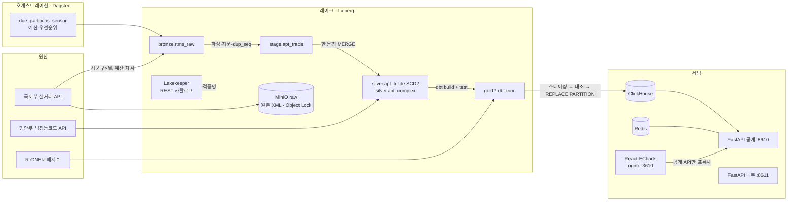

# AptLake — 집값 레이크하우스

전국 아파트 매매 실거래 신고 자료를 **Iceberg 레이크하우스(Bronze → Silver → Gold)** 로 쌓고,
고유 ID가 없고 나중에 값이 바뀌는 원천을 **지문 키 + 한 문장 MERGE(SCD2)** 로 정합하게 관리하며,
**품질 검사를 통과한 데이터만** ClickHouse 서빙 계층과 **API 키·쿼터·계측이 있는 데이터 API** 로 제공합니다.

> 공개 신고 자료를 가공한 학습·포트폴리오용 서비스입니다. 자체 산출 지수는 공식 통계가 아니며 투자 판단 근거로 쓰지 마세요.
> (모든 API 응답과 화면에 같은 문구를 표시합니다.)

| 화면 | 주소 (모두 127.0.0.1 바인딩) |
|---|---|
| 웹 (지역 탐색·거래·지수·품질·개발자) | http://127.0.0.1:3610 |
| 공개 데이터 API · OpenAPI 문서 | http://127.0.0.1:8610/docs |
| 관리 API (내부 리스너) | http://127.0.0.1:8611/docs |
| Dagster (자산·파티션·검사) | http://127.0.0.1:3600 |
| Grafana (`make obs`) | http://127.0.0.1:3620 |

---

## 1. 풀려는 문제

1. **고유 ID 가 없다.** 응답에 거래 식별자가 없고, 같은 단지·면적·층·날짜·금액 거래가 여러 건일 수 있다 (실측: 2024-07 종로·분당 776건 중 33개 그룹).
2. **값이 나중에 바뀐다.** 해제여부·해제일·등기일·동명이 사후에 채워진다 → 한 번 받고 끝내면 해제 거래가 통계에 남는다.
3. **호출 예산이 있다.** 개발계정 일 10,000회, 시군구 256 × 계약월 수백 개를 나눠 수집해야 한다.

→ "재수집해도 중복되지 않고, 바뀐 값은 이력으로 남고, 검사를 통과한 데이터만 공개되는" 파이프라인이 본체.

## 2. 아키텍처



- **엔진은 스토리지 키를 갖지 않습니다.** Trino·PyIceberg 는 Lakekeeper 가 STS 로 발급한 테이블 경로 범위 단기 자격증명(vended credentials)으로만 MinIO 에 접근합니다. 장기 키는 카탈로그 계정 하나.
- **발행은 원자적입니다.** gold 월 파티션 → ClickHouse `*_staging` 적재 → Trino 결과와 건수·합계 대조 → `REPLACE PARTITION`. 대조가 틀리면 서빙 테이블은 이전 데이터 그대로입니다.
- **데이터셋 버전.** 발행마다 `gold@YYYY-MM-DD.n` 과 입력 Iceberg 스냅샷 ID(bronze·silver·gold)를 기록 → API 응답 헤더 `X-Dataset-Version` / `X-Data-As-Of`, 캐시 키·ETag 에 포함, `/v1/quality/partitions/{sgg}/{ym}` 에서 계보로 조회.

## 3. 기획서 대비 구현 결정

기획서의 기술 스택을 그대로 따르지 않고, 로컬(M1 16GB, Docker VM 7.7GB 중 다른 프로젝트가 약 3.8GB 사용)에 맞게 조정했습니다. 자세한 근거는 [docs/decisions.md](docs/decisions.md).

| 기획 | 구현 | 이유 |
|---|---|---|
| Spark 3.5 MERGE INTO | **Trino MERGE** (Iceberg) | Spark JVM 3GB 를 뺄 수 있음. Trino MERGE 가 조건부 WHEN 절을 지원해 SCD2 를 한 문장으로 표현 |
| SCD2 한 번 vs 두 단계 (U-4) | **한 문장** (UPSERT·NEWVER·MISSING 세 갈래 원천) | 한 스냅샷 = 원자적. '닫기'와 '새 버전' 사이 중간 상태가 없음 |
| REST 카탈로그 Lakekeeper vs Polaris (U-1) | **Lakekeeper v0.13.6** + vended credentials | 엔진이 장기 키를 갖지 않음 |
| Dagster 파티션 = 시군구 × 월 | **파티션 = 계약월**, 시군구 상태는 `ops.ingest_partition` | 256×수백 = 수만 개 Dagster 파티션은 실행 오버헤드가 수집 비용보다 큼 |
| MinIO | **Silo**(MinIO 유지보수 포크, Lakekeeper 공식 예제 사용) | 커뮤니티 이미지 배포 중단 |
| API 하나 + 127.0.0.1 검사 | **공개·내부 리스너 분리** | 관리 라우트가 공개 프로세스에 아예 없음 (도커 포워딩에서는 원 IP 를 믿을 수 없음) |
| ClickHouse `ReplacingMergeTree` + FINAL | **MergeTree + 파티션 교체** | 발행 시점에 중복이 없으므로 FINAL 비용 불필요 |

## 4. 정합성 설계

**지문 키 · 순번** ([fingerprint.py](pipeline/src/aptlake_pipeline/rtms/fingerprint.py))
- `trade_key = sha256(시군구 | 법정동 | 정규화 지번 | 정규화 단지명 | 면적(4자리) | 계약일 | 금액 | 층)` — 사후에 바뀌는 필드는 제외하고 `attr_hash` 로 따로 비교.
- `dup_seq` 는 입력 순서가 아니라 `(trade_key, attr_hash)` 정렬로 부여 → **API 가 같은 결과를 다른 순서로 줘도 같은 순번** (hypothesis 속성 테스트).
- 공개 ID `trade_id = {시군구}-{계약월}-{지문 16자}-{순번}` → 서빙 계층에서 파티션 가지치기.

**한 문장 SCD2 MERGE** ([silver.py](pipeline/src/aptlake_pipeline/silver.py)) — Trino MERGE 는 대상 1행에 원천 1행만 매칭되고 `NOT MATCHED BY SOURCE` 가 없어서 원천을 세 갈래로 만든다.

| 원천 행 | 매칭 | 동작 |
|---|---|---|
| UPSERT (이번 수집 전부) | 현재행과 속성 같음 | `last_seen` 갱신 |
| | 속성 다름 | 현재행 닫기 (`is_current=false, valid_to`) |
| | 없음 | 신규 거래 INSERT |
| NEWVER (속성 바뀐 행, 매칭 키 NULL) | 항상 불일치 | 새 버전 INSERT (`version+1`) |
| MISSING (이번 수집에 없는 현재행) | 현재행 | 삭제하지 않고 `missing_since` |

**품질 게이트** — 실패하면 하위로 전파되지 않습니다.

| 층 | 검사 | 차단 |
|---|---|---|
| bronze (시군구 단위) | 원천 스키마 v1 일치, 전 행 파싱·파티션 소속, 이전 대비 30% 넘는 급감 | 그 시군구만 QUARANTINED, 나머지 진행 (FR-104) |
| bronze (월) | LOADED 행 스키마 재검증, 격리율 < 20% | Dagster blocking asset check |
| silver | 현재행 키 중복 0, 시군구별 stage 행 수 = 관측 현재행 수 | blocking |
| silver | 3회 연속 미관측, 해제 비율 10%p 급변, 동일 지문 그룹 수 | 경고 |
| gold (dbt) | unique·not_null·relationships·accepted_values·범위·`trades+cancelled=reported`·분위수 순서 | 실패 시 dbt build 실패 → 같은 실행의 ClickHouse 발행 안 됨 |
| 발행 | Trino ↔ ClickHouse 건수·합계 대조 | 불일치 시 파티션 교체 안 함 |
| 복구 | silver 반영 후 발행 전 실패한 달은 `needs_publish` 로 남고, 센서가 원천 호출 0회로 검사 재계산 → gold → 발행 | 발행 누락 방지 |

**정확 분위수.** `approx_percentile` 대신 선형 보간 정확 분위수 SQL 매크로 → 실측 **numpy.percentile 과 차이 0.0** (종로 55건, 분당 691건).

## 5. 보안 설계 (구현된 것)

| 위협 | 대응 | 위치 |
|---|---|---|
| DB 유출 시 키 재사용 | 키 `al_live_<id>.<secret>`, 서버는 `HMAC-SHA256(pepper, secret)` 만 저장, 상수시간 비교, 없는 키도 같은 비용으로 비교 | [keys.py](api/src/aptlake_api/keys.py), [auth.py](api/src/aptlake_api/auth.py) |
| 폐기 지연 | 폐기 시 Redis 키 캐시 즉시 삭제 + 프로세스 캐시 TTL 5초 | `DELETE /v1/admin/keys/{id}` |
| 스코프 누락 | 모든 라우트가 `require_scope` 를 선언했는지 **기동 시 검사**, 빠지면 기동 실패 (include_router 안쪽까지) | [deps.py](api/src/aptlake_api/deps.py) |
| 관리 API 원격 호출 | 관리 라우트는 별도 프로세스·포트(:8611), 웹 프록시는 공개 API 만 전달, 모든 변경은 append-only 감사 로그 | compose `api-internal`, [nginx.conf](web/nginx.conf) |
| SQL 주입 | ClickHouse 서버측 파라미터 바인딩만, 식별자 허용 목록, 경로·쿼리 정규식 검증. dbt var·Trino 리터럴은 형식 검증 후에만 | [routes_public.py](api/src/aptlake_api/routes_public.py), [silver.py](pipeline/src/aptlake_pipeline/silver.py) |
| 대량 추출 | 분당 요청(슬라이딩 윈도우, Redis Lua 원자) + 일일 행 한도 + 기간 상한 + **서명된 커서**(다른 질의 재사용·변조 시 400) + 대량은 비동기 내보내기(pro) | [auth.py](api/src/aptlake_api/auth.py), [cursor.py](api/src/aptlake_api/cursor.py) |
| IP 위조 | `X-Forwarded-For` 는 웹 프록시 고정 IP 에서 온 경우만, 오른쪽부터 신뢰하지 않는 첫 주소. 익명 사용자 IP 는 HMAC 으로만 저장 | `client_ip()` |
| 서빙 DB 변경 | ClickHouse 사용자 분리: `api_reader`(readonly=1, 5초·300MB·결과 행 상한), `usage_writer`(usage_event INSERT 만), `exporter`, `publisher` | [aptlake-users.xml](infra/clickhouse/users.d/aptlake-users.xml) |
| 저장소 과권한 | MinIO 계정 분리: ingest(raw Put/Get), catalog(lake), export(exports). raw 버킷 Object Lock(GOVERNANCE 365일), exports 1일 자동 삭제 | [minio/init.sh](infra/minio/init.sh) |
| DB 과권한 | PostgreSQL 역할 분리 (migrator 소유 / pipeline / api_app). api_app 은 격리 재시도에 필요한 **열만** UPDATE, 감사 로그 INSERT·SELECT 만 | [V001](api/migrations/V001__ops_api_schema.sql) |
| Redis 과권한 | ACL: default 끔, api(`al:*`)·pipeline(`budget:*`, `al:ds:*`) 키 접두사·명령 범위 분리 | compose `redis` |
| Trino 권한 | 파일 기반 접근 제어: pipeline·dbt 쓰기, analyst 읽기 전용, 그 외 거부 | [rules.json](infra/trino/etc/rules.json) |
| XML 공격 | `defusedxml` (엔티티 확장 거부 테스트) | [parse.py](pipeline/src/aptlake_pipeline/rtms/parse.py) |
| 비밀 유출 | `.env` git 제외(600), 내부 비밀 자동 생성, 설정 객체 repr 마스킹, gitleaks 규칙(`al_live_`), 컨테이너 read-only·cap_drop·no-new-privileges | [.gitleaks.toml](.gitleaks.toml), CI |
| 브라우저 | CSP `default-src 'self'`, X-Frame-Options, nosniff, API 키는 React state 에만 (저장소·URL 에 쓰지 않음) | [nginx.conf](web/nginx.conf) |
| 공급망 | uv.lock·package-lock 고정, pip-audit·npm audit·Trivy·Dependabot | [ci.yml](.github/workflows/ci.yml) |

## 6. 성능 (측정값)

측정 조건과 원자료는 [docs/performance.md](docs/performance.md). 목표값은 기획서 NFR-04 (로컬 기준 제안값).

| 항목 | 목표 | 측정 (캐시 비운 상태) |
|---|---|---|
| 지역·월 통계 p95 | < 80 ms @ 200 RPS | **38.6 ms** @ 200 RPS |
| 거래 목록(200행) p95 | < 150 ms @ 100 RPS | **42.0 ms** @ 100 RPS |
| 처리량 · 오류 | — | 300 RPS 유지, 데이터 요청 실패 0 |
| 캐시 미스 경로 p95 | — | 145.6 ms — 같은 구간 ClickHouse 서버 질의 p95 는 7~19 ms 라 대부분 API 워커·CPU 대기 |
| 전국 한 달 파이프라인 | — | **1분 45초** (45,980건: 수집 47s · silver 17s · dbt 16s · 발행 3.4s) |

첫 측정은 p95 4.9초·실패 8.9% 였습니다. 원인은 (1) Redis 연결 풀 고갈(`MaxConnectionsError` → 500), (2) 요청당 Redis 왕복 약 8회, (3) 단일 워커. 대기형 풀, Lua 한 번에 한도·행 사용량 조회, 프로세스 내 키 캐시(5초), 캐시 값 한 키 저장, 워커 4개로 바꿔 위 수치가 됐습니다.

## 7. 원천에서 직접 확인한 사실 (W1 스파이크)

추측으로 채운 값은 없습니다. 아래는 실제 호출로 확인한 것이고, 확인 도구는 [tools/probe_rtms.py](tools/probe_rtms.py).

| 사실 | 근거 |
|---|---|
| `numOfRows=9999` 면 시군구·월당 1회 호출로 전량 수신 | 41135/2025-09: totalCount 1,099 = 수신 1,099 |
| 조회 가능 계약월은 2006-01 부터 | 11680: 2006-01 245건, 2005-12 0건 |
| 빈 값은 공백 한 칸, 해제는 `cdealType=O`, 해제일·등기일은 `YY.MM.DD` | 응답 원문 |
| 일반구를 둔 시(예 41130 성남시)는 0건, 구 코드로 조회 | 41130: 0건 / 41131·41133·41135: 310·278·1,099건 |
| 2026-07 전남광주 통합 후, 과거 계약월도 새 코드로 제공 | 12110 의 2024-09: 230건, 옛 29110: 0건, 항목 sggCd=12110 |
| 법정동코드 API 는 구의 상위(locathigh_cd)를 시가 아니라 도로 가리킴 | 41135 → 4100000000 → 상위 시 판별은 공식 명칭 포함 관계로 (leaf 256개) |
| R-ONE 기준 지수: `A_2024_00178 (월) 지역별 매매지수_아파트`, 2006-01~2026-07, 2026.06=100 | SttsApiTbl·SttsApiTblData 응답 |

R-ONE 약칭(서울·충북·전남광주…) → 시도 코드는 손으로 쓴 표가 아니라 공식 시도 명칭에 대한 "접두어 → 글자 순서 포함, 유일할 때만" 규칙으로 매핑합니다 ('수도권' 같은 묶음은 매핑하지 않음).

## 8. 자체 지수 HEDONIC_TD_v1

`log(㎡당 가격) = 단지 고정효과 + 월 더미 + 층 구간 + 면적 구간 + ε`, 지수 = `100·exp(월 계수)`.
수백만 행의 평균 차감 설계행렬을 조밀하게 만들지 않고 희소 행렬로 `X̃'X̃ = X'X − (G'X)'diag(1/n)(G'X)` 를 직접 계산(메모리 O(nnz)), 표준오차는 **단지 군집 강건**.
합성 데이터로 알려진 월 효과 복원(오차 < 1%), 구성 편향 제거(비싼 단지 비중 급증에도 지수 ±1 이내)를 테스트합니다.
수집이 완결된 달(시군구 90% 이상 반영)만 쓰고 — 백필 중 일부 지역만 있는 달을 넣으면 지역 간 추세 차이가 월 효과로 섞이는 것을 실제로 관찰해 추가한 규칙입니다. R-ONE 과는 월간 변화율 상관·방향 일치율로 비교합니다 (6개월 이상 겹칠 때).

## 9. 실행

필요: macOS(Apple Silicon) · Docker Desktop · `uv` · Node 24 (개발 시).

```bash
make init          # .env 생성, 내부 비밀번호·pepper 자동 생성 (외부 키 2개는 직접 입력)
make up            # 전체 스택 빌드·기동 (첫 빌드 수 분)
make lake-init     # Iceberg 테이블 + 시군구 목록
make backfill-start  # 수집 센서·스케줄 켜기 → 예산 안에서 최신 월부터 자동 수집
make admin-key     # 관리자 키 (1회 표시)
make demo-keys     # free·pro 데모 키 (1회 표시)
make index         # 단지 차원·자체 지수·R-ONE 검증 산출 (매일 05:30 KST 스케줄도 있음)
```

| 명령 | 설명 |
|---|---|
| `make serve` | 수집 없이 서빙만 (ClickHouse·API·웹) — 메모리 절약 |
| `make obs` | Prometheus·Grafana (대시보드 자동 등록) |
| `make month ym=202408` | 한 달 수동 실행 |
| `make pipeline-redeploy` | 실행 중인 달이 끝나길 기다렸다가 파이프라인 코드 교체 |
| `make test` / `make test-integration` | 단위·API(Testcontainers) / 실행 중 스택에서 SCD2 통합 테스트 |
| `make loadtest` | k6 (`export APTLAKE_KEY=$(make -s loadtest-key)`) |
| `make lint` · `make audit` | ruff·mypy·tsc / pip-audit·npm audit |

API 예:

```bash
curl -H "X-API-Key: $KEY" "http://127.0.0.1:8610/v1/regions/41135/months?from=2025-01&to=2025-12"
curl -H "X-API-Key: $KEY" "http://127.0.0.1:8610/v1/trades?sggCd=41135&from=2026-08-01&to=2026-08-31&limit=200"
curl -H "X-API-Key: $KEY" "http://127.0.0.1:8610/v1/quality/partitions/41135/2026-08"
```

## 10. 테스트

| 층 | 수 | 내용 |
|---|---|---|
| 파이프라인 단위 | 37 | 실제 응답 XML fixture, 파서, 정규화, 지문·순번(hypothesis: 순서 무관·유일), 엔티티 확장 거부, 시군구 도출, R-ONE 매핑, 지수(알려진 효과 복원·구성 편향), 예산 상한 |
| 정합성 통합 | 2 | 실제 Lakekeeper·MinIO·Trino: 3회 재반영 불변, 해제 → 새 버전·이전 버전 닫힘, 사라짐 → missing, 재등장 → 해제 / 100 스레드 동시 예산 차감 → 정확히 상한 |
| API | 27 | Testcontainers(PostgreSQL·Redis·ClickHouse, 운영과 같은 마이그레이션·사용자 설정): 헤더 계약, ETag 304, 플랜 기간, 폐기 즉시 401, 스코프, 관리 라우트 부재, 커서 완결성·위조, 주입 문자열, 사용량 격리, 429 |
| dbt | 17 | 월 파티션마다 실행, 실패 시 발행 차단 |
| 부하 | k6 | 200 + 100 RPS + 한도 초과 시나리오 |

## 11. 한계

- 지문 필드(금액·층·면적 등)가 사후 정정되면 "사라짐 + 새 거래"로 보입니다. 미관측 3회 경고와 동일 지문 그룹 수를 품질 지표로 공개하지만 자동 병합은 하지 않습니다.
- 동일 지문 그룹 안에서 한 건만 바뀌면 순번 정렬이 바뀌어 두 건이 동시에 변경으로 보일 수 있습니다.
- 개발계정 호출 한도 때문에 전체 백필은 며칠 걸립니다 (`BACKFILL_FROM`, 기본 2021-01).
- 로컬 단일 노드 기준입니다. Lakekeeper 는 인증 없이 도커 네트워크 안에서만 쓰고(호스트 127.0.0.1), 운영이라면 OIDC 와 TLS 가 필요합니다.
- 부하 측정은 k6 가 같은 Docker VM 에서 돌아 CPU 를 나눠 씁니다. 수치는 이 맥 기준입니다.

## 12. 구조

```
aptlake/
├─ docker-compose.yml        # 서비스 16개(일회성 초기화 4개 포함), 프로필(lake·obs), 전 포트 127.0.0.1, 메모리 상한
├─ Makefile
├─ infra/                    # postgres·minio·lakekeeper·trino·clickhouse·prometheus·grafana 설정
├─ pipeline/                 # Dagster 자산 + 수집·정합·발행·지수 (Python 3.12, uv)
│  ├─ src/aptlake_pipeline/
│  ├─ dbt/                   # gold 모델·매크로(정확 분위수)·테스트
│  └─ tests/
├─ api/                      # FastAPI 공개·내부 앱, 마이그레이션, CLI
├─ web/                      # React + Vite + ECharts, nginx
├─ loadtest/api.js           # k6
├─ tools/                    # .env 초기화, 원천 스파이크
└─ docs/                     # 결정 기록·성능·운영
```
